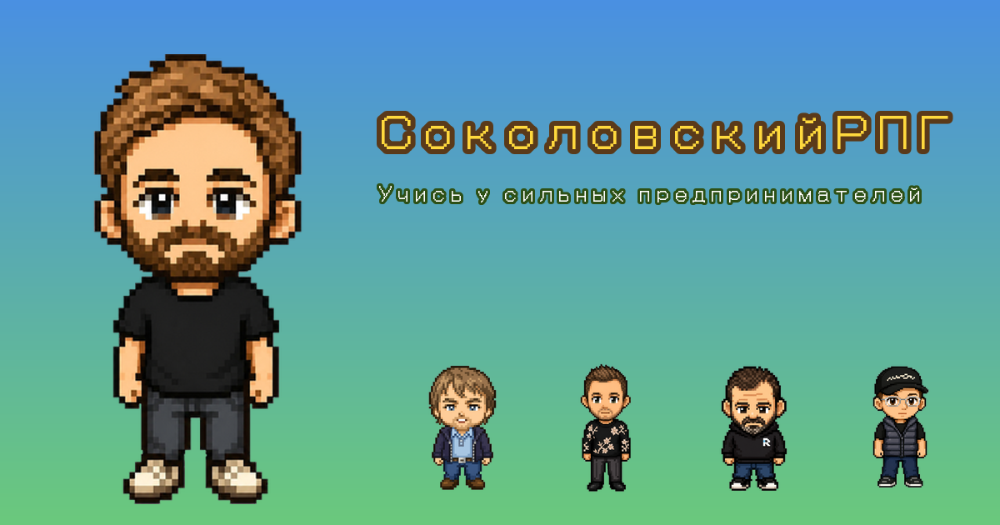

# 🎮 СоколовскийРПГ — учись у сильных

[](https://srpg.yakovtsev.ru)
[](https://www.youtube.com/channel/UCaR6XjSJJsLbKN3n6VYsGKw)

**Ретро-RPG по [Подкасту Соколовского](https://www.youtube.com/channel/UCaR6XjSJJsLbKN3n6VYsGKw): лови гостей-предпринимателей и угадывай их полезные мысли.**

Как покемоны, только вместо монстров — известные основатели, а вместо тривии — их реальные **инсайты**: подходы, принципы и решения, которые применимы к твоему делу и жизни.



---

## 🎯 Об игре

Каждый гость подкаста — ловимый персонаж. Чтобы поймать его в коллекцию, отвечай на вопросы о том, **что он на самом деле думает** про общие темы (риск, найм, фокус, неудачи, деньги, дистрибуция…). Вопросы не на знание фактов о компании, а на **переносимую пользу** — что-то, что заберёшь себе.

**10 гостей:** ВкусВилл, Hoff, White Rabbit, 12STOREEZ, Whitewill, СДЭК, Додо Пицца, ТЕХНОНИКОЛЬ, amoCRM, братья Либерманы.

## ✨ Особенности

- 🧠 **Инсайты, а не тривия** — 10 гостей × 5 полезных мыслей
- 🎮 **Ретро-RPG в духе покемонов** — ходишь по миру, ловишь гостей в боях
- 🎨 **Пиксель-арт**, чиби-персонажи, главный герой — сам Соколовский с микрофоном
- ⚡ **Чистая статика** — без бэкенда, мгновенно открывается в браузере

## 🚀 Играть

🎯 **[srpg.yakovtsev.ru](https://srpg.yakovtsev.ru)** — установка не нужна, всё в браузере.

## 🛠️ Стек

- **Движок:** [Phaser 3.90](https://phaser.io) (HTML5)
- **Фронтенд:** [Vue 3.5](https://vuejs.org/)
- **Сборка:** [Vite 6](https://vitejs.dev/)
- **Деплой:** multi-stage Docker (node собирает → nginx раздаёт `dist`), через Coolify

## 💻 Разработка

```bash
git clone https://github.com/scrm77/sokolovsky-rpg.git
cd sokolovsky-rpg
npm install
npm run dev     # http://localhost:8080
npm run build   # продакшен-сборка в dist/
```

**Контент** игры — в `public/assets/questions.json` (10 гостей, по 5 инсайтов с вариантами и пояснениями). Спрайты и аватары — в `public/assets/`.

## 🙏 Вдохновение и благодарность

Игра — фан-ремикс на открытом движке **[LennyRPG / PokeLenny](https://github.com/hbshih/PokeLenny)** автора **[Ben Shih](https://benshih.design/)** ([оригинал](https://www.lennyrpg.fun/), сделан по мотивам [подкаста Lenny](https://www.lennysnewsletter.com/podcast)).

Огромное спасибо за открытый код и саму идею «подкаст как игра» — мы лишь заменили героев, контент и оформление под русскоязычную аудиторию и Подкаст Соколовского.

## 📜 Лицензия

Движок распространяется под лицензией **MIT** (см. [`LICENSE`](LICENSE)). 

Неофициальный фан-проект, **без аффилиации** с Александром Соколовским и его подкастом. Имена, образы и упоминания принадлежат их владельцам. Часть графики сгенерирована ИИ.
